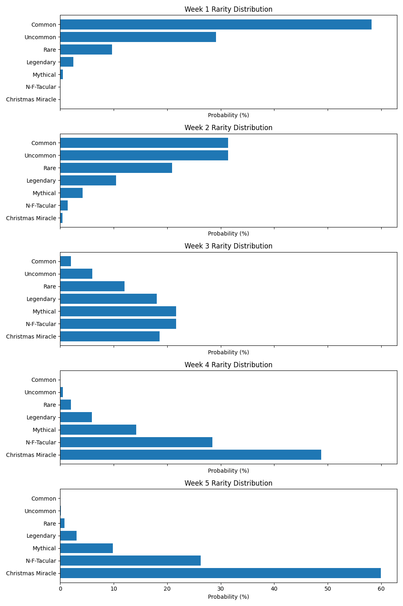

# --------------------------------------------------------------- #
# vvvvvv DEVELOPER EYES ONLY vvvvvv
# --------------------------------------------------------------- #
# Rarity Level Overview

There are 7 NFT Rarity Levels.

| Rarity Level      | Initial Probabilities |
| -----------       | -----------           |
| Common 		    | 58.199 %              |
| Uncommon 		    | 29.099 %              |
| Rare 		        | 9.700 %               |
| Legendary 		| 2.425 %               |
| Mythical 		    | 0.485 %               |
| N-F-Tacular 		| 0.081 %               |
| Christmas Miracle | 0.012 %               |

Every week, the probability mass function (PMF) describing the "rarity" or "drop rate" for NFTs characterized by each Rarity Level will be modified as described in the PMF histograms.

# Elements
## Frames

All frames are stolen from Steam's point store and are added to the border of the AI-generated art piece.
Each rarity level has different frame options.

| Rarity Level      | Frame Options |
| -----------       | -----------  | 
| Common            | None |
| Uncommon          | <ul><li>Portal Blue</li><li>Portal Orange</li></ul> |
| Rare              | <ul><li>Darkage [red]</li><li>Darkage [blue]</li></ul> |
| Legendary         | <ul><li>Darkage [rgb]</li><li>Glitch [unstable]</li></ul> |
| Mythical          | <ul><li>Glitch [Neon]</li><li>Neon Frame</li><li>Glitch Wave</li></ul> |
| N-F-Tacular       | <ul><li>Speedlines</li><li>Rain of gold</li><li>Cat Graffiti</li></ul> |
| Christmas Miracle | Christmas lights |

Total Frames: 14

## Subjects

| Subjects      |
| -----------   |
| Cat           |
| Dog           |
| Monkey        |
| Panda         |
| Owl           |
| Lion          |
| vv Mythical + vv | 
| Baby          |
| Robot         |
| Dragon        |
| vv Only Christmas Miracle vv | 
| Reindeer      |
| Santa Claus   |

Total Subjects: 11

## Age

| Ages          |
| -----------   |
| None          |
| Baby          |
| Young         |
| Old           |

None just means not specified in this context.

Total Subjects: 4

## Hats

| Hats        |
| ----------- | 
| None        |
| Winter Hat  |
| Nightcap    |
| vv Only N-F-Tacular + vv |
| Beanie      |
| Robobt Head |
| vv Only Christmas Miracle vv |
| Santa Hat   |
| Party Hat   |

Total Hats: 6

## Eyes

| Eyes           |
| -----------    | 
| White          |
| Black          |
| Blue           |
| Brown          |
| Green          |
| vv Only Mythic + vv |
| Purple         |
| Neon           |
| RGB            |
| vv Only N-F-Tacular + vv |
| Rainbow        |
| Fire           |
| Sunglasses     |
| Laser eyes     |
| vv Only Christmas Miracle vv |
| peppermint      |

Total Eyes: 13

## Scarfs

| Scarf          |
| -----------    |
| None           |
| White          |
| Black          |
| Blue           |
| Brown          |
| Green          |
| vv Only Mythic + vv |
| Purple         |
| Neon           |
| RGB            |
| vv Only N-F-Tacular + vv |
| Rainbow        |
| Fire           |
| vv Only Christmas Miracle vv |
| peppermint      |

Total Scarfs: 13

## Christmas Sweaters

| Sweaters       |
| -----------    |
| None           |
| White          |
| Black          |
| Blue           |
| Brown          |
| Green          |
| vv Only Mythic + vv |
| Purple         |
| Neon           |
| RGB            |
| vv Only N-F-Tacular + vv |
| Rainbow        |
| Fire           |
| vv Only Christmas Miracle vv |
| peppermint      |

Total Sweaters: 13

## Backgrounds

| Backgrounds    |
| -----------    | 
| Snow           |
| Ice            |
| Space          |
| vv Only Christmas Miracle vv | 
| Fireplace      |
| Christmas Tree |
| North Pole     |

Total Backgrounds: 7

## Style

| Style          |
| -----------    | 
| Realistic      |
| Cartoon        |
| NFT            |
| Pixel          |

Total Styles: 4
